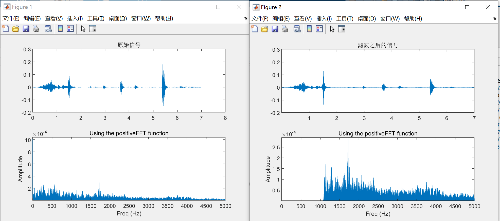
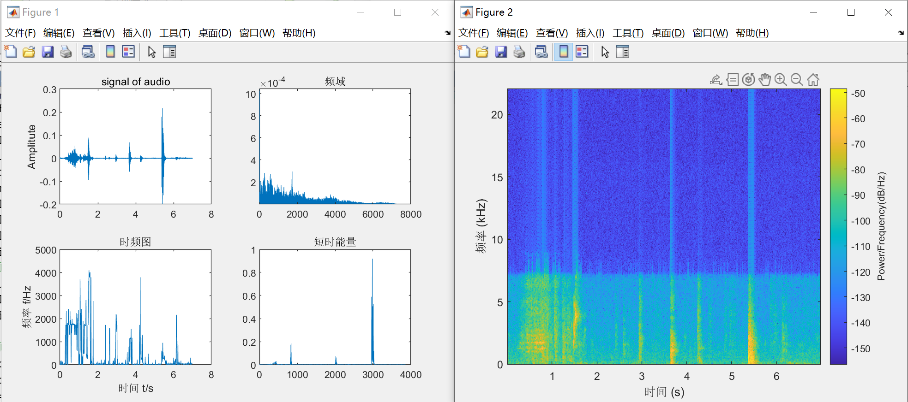

# 语音信号处理

#### 介绍
本仓库包含一些语音信号的处理。
matlab读取，频域转化，短时能量，时频特征图，语谱图等特征；
matlab脚本的自动化读取大量语音文件，并生成保存需要的特征图；
matlab脚本的自动迭代扫频扫带宽找特优值带宽值；
python脚本的语音信号自动自动化分割、储存。
（待更新。。。。。）

#### 需求环境
matlab

#### 文档介绍
######1.  feature_matlab文件夹
* mian1.m
test.wav信号的原信号和频域信号图，经过带通滤波之后的信号和对应的频域信号。En1 En2滤波前后的能量，rate是滤波前后能量比。

* main2.m
test.wav信号的时域，频移，短时能量，时频曲线图（功率最大的频点随时间的变化曲线）；以及语谱图的展示。

* bandpass_filter.m滤波器函数
* positiveFFT.m FFT频域变换函数
* func_enframe 和func_frame2time是短时能量辅助函数

#### 联系方式
探索更多语音信号处理特征
20210720121@fudan.edu.cn